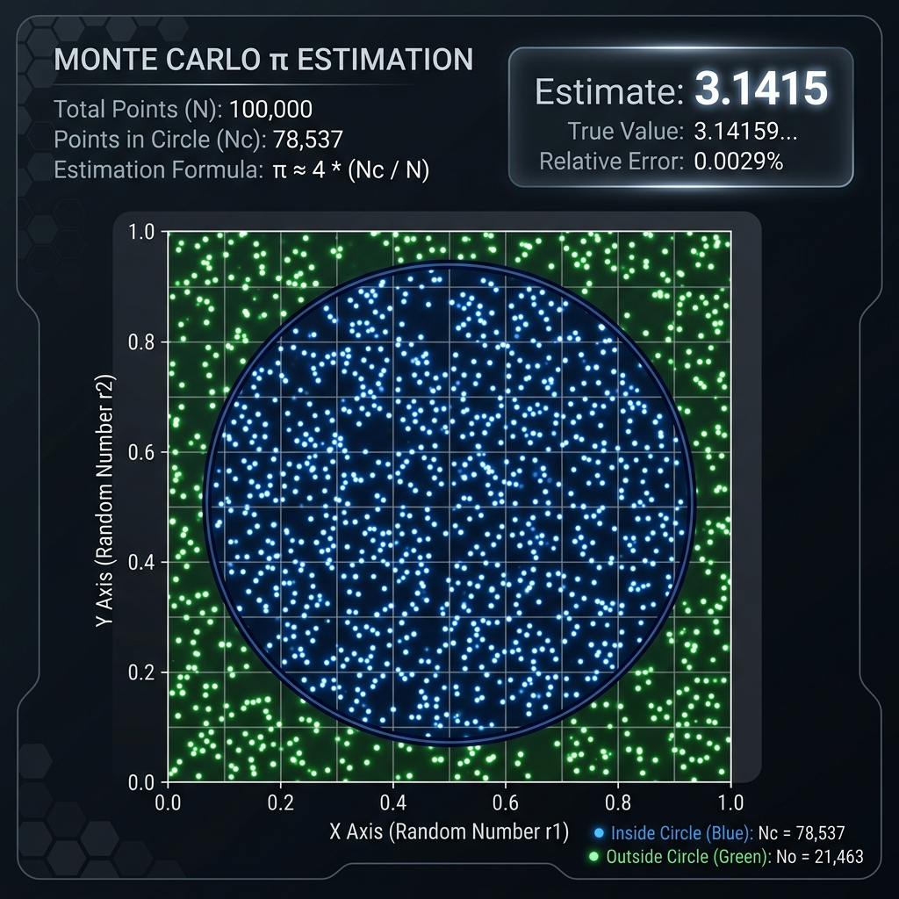

# 📊 Jasleen Kaur - Personal Portfolio & Computational Sandbox

[](https://jasleen23456.github.io/jasleen-portfolio/)
[](https://opensource.org/licenses/MIT)
[](https://developer.mozilla.org/en-US/docs/Web/HTML)
[](https://developer.mozilla.org/en-US/docs/Web/CSS)
[](https://developer.mozilla.org/en-US/docs/Web/JavaScript)

Welcome! This is the source code repository for my personal portfolio website, custom-designed to highlight my expertise in **Data Science, Applied Statistics, and AI Evaluation**. 

Rather than just displaying a static resume, this portfolio serves as an interactive playground featuring a **Live Monte Carlo Simulation Widget** and **Embedded Sandbox Demos** for my core professional certifications.

🔗 **Live Link:** [https://jasleen23456.github.io/jasleen-portfolio/](https://jasleen23456.github.io/jasleen-portfolio/)

---

## ⚡ Core Features & Interactive Sandboxes

### 1. Dynamic Network Particle Canvas
- **Ambient Graphics:** A custom HTML Canvas background rendering an interactive node-and-connector network that moves dynamically with user interaction, representing data grids and neural linkages.

### 2. Interactive Competency Alignment Radar
- **Skill Map:** An interactive SVG-based Radar Chart visualizing proficiency distribution across my core domains: Core Python, Statistics, AI/ML, Data Visualization, and Mathematics.

### 3. Live Monte Carlo $\pi$ Estimator Sandbox
- **Computational Demo:** A fully interactive Monte Carlo Simulation widget. 
- **Configuration:** Users can adjust the sample size (number of random points) and simulation speed.
- **Visuals:** Renders random points falling inside a unit circle in real-time, displaying the calculated estimate of $\pi$, current error margin, and convergence updates.

<p align="left">
  
</p>

### 4. Interactive Certification Modals
Clicking any certification card opens an immersive overlay modal containing a live, interactive sandbox tool:
- **AI-Powered Chatbot QA (Coursera AI Chatbot Development):** A mock chatbot interface responding dynamically to questions about my background, GPA, and skills.
- **CNN Classifier Dashboard (Coursera Machine Learning Classifier):** A simulated Keras Convolutional Neural Network pipeline. Select test images to run a simulated classification with animated probability charts.
- **Lexical NLP Sentiment Highlighter (Coursera Twitter Sentiment Analysis):** A live lexical sentiment tool. Type text to tokenize words and highlight positive and negative sentiments in real-time.
- **Statistical Distribution Visualizer (JHU Data Science Crash Course):** Renders descriptive population distribution boxplots representing statistical summaries.

<p align="left">
  
</p>


---

## 🛠️ Technology Stack
- **Structure:** Semantic HTML5 (SEO-optimized, accessible structural hierarchy).
- **Styling:** Custom Vanilla CSS3 (glassmorphic containers, custom scrollbars, responsive fluid typography, flexbox/grid layout, and glowing transitions). *No heavy frameworks like Tailwind to ensure lightweight performance.*
- **Logic:** Vanilla ES6+ JavaScript (DOM manipulation, canvas animations, and mathematical solvers).

---

## 📂 File Structure
```filepath
jasleen-portfolio/
│
├── index.html       # Main HTML5 page structure and SEO meta tags
├── style.css        # Responsive layouts, glassmorphism design, and keyframe animations
├── script.js        # Canvas network animations, Monte Carlo calculator, and modal simulators
├── upload.ps1       # Interactive PowerShell deployment runner using GitHub REST API
└── run_upload.ps1   # Automated non-interactive upload runner
```

---

## 🚀 How to Run Locally
1. Clone or download this repository.
2. Navigate into the directory.
3. Open `index.html` directly in any web browser:
   ```bash
   # On Windows (cmd)
   start index.html
   
   # On macOS
   open index.html
   ```
4. No compilation, local servers, or package installations are required!
